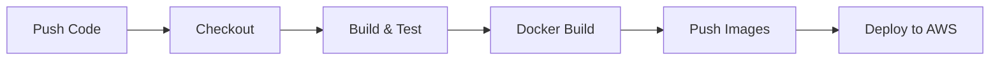

# 🚀 Cloud-Based Automated Deployment System for MERN Stack

[](https://github.com/Ayan113/Cloud-Based-Automated-Deployment-System-for-Startups/actions/workflows/ci-cd.yml)
[](https://hub.docker.com/u/ayan1813)
[](https://mern-deploy-frontend-4s9t.onrender.com)

A **production-ready, fully automated deployment system** for MERN stack applications. Built specifically for startups that need reliable, fast, and secure deployments without the complexity of enterprise solutions.

## 🌐 Live Demo

| Service | URL | Status |
|---------|-----|--------|
| **Frontend Dashboard** | [https://mern-deploy-frontend-4s9t.onrender.com](https://mern-deploy-frontend-4s9t.onrender.com) | ✅ Live |
| **Backend API** | [https://mern-deploy-backend-kr8n.onrender.com](https://mern-deploy-backend-kr8n.onrender.com) | ✅ Live |
| **Health Check** | [https://mern-deploy-backend-kr8n.onrender.com/api/health](https://mern-deploy-backend-kr8n.onrender.com/api/health) | ✅ Healthy |
| **Docker Hub** | [ayan1813/mern-deploy-backend](https://hub.docker.com/r/ayan1813/mern-deploy-backend) | ✅ Published |

---

## 📋 Table of Contents

- [Live Demo](#-live-demo)
- [Why This Matters](#-why-this-matters)
- [Architecture](#-architecture)
- [Features](#-features)
- [Quick Start](#-quick-start)
- [Project Structure](#-project-structure)
- [CI/CD Pipeline](#-cicd-pipeline)
- [Environment Configuration](#-environment-configuration)
- [Security](#-security)
- [Troubleshooting](#-troubleshooting)

---

## 🎯 Why This Matters

### The Startup Problem

| Challenge | Impact | Our Solution |
|-----------|--------|--------------|
| **Manual Deployments** | Human errors, inconsistency | Fully automated CI/CD pipeline |
| **Deployment Downtime** | Lost revenue, user frustration | Zero-downtime container deployments |
| **Configuration Drift** | "Works on my machine" issues | Docker containers ensure consistency |
| **Security Vulnerabilities** | Data breaches, compliance issues | Secure secrets management, security headers |
| **Scaling Challenges** | Can't handle traffic spikes | Container orchestration ready |

### Real-World Relevance

- **For Early-Stage Startups**: One-click deployments mean engineers focus on features, not infrastructure
- **For Growing Teams**: New developers can deploy confidently from day one
- **For Production Apps**: Health checks and monitoring ensure reliability
- **For Compliance**: Environment separation and audit trails built-in

---

## 🏗 Architecture

```
┌─────────────────────────────────────────────────────────────────────────┐
│                           GITHUB REPOSITORY                              │
│                                  │                                       │
│                           ┌──────▼──────┐                               │
│                           │   PUSH TO   │                               │
│                           │    MAIN     │                               │
│                           └──────┬──────┘                               │
└──────────────────────────────────│──────────────────────────────────────┘
                                   │
                    ┌──────────────▼──────────────┐
                    │     GITHUB ACTIONS CI/CD    │
                    │  ┌────────────────────────┐ │
                    │  │ 1. Checkout Code       │ │
                    │  │ 2. Install & Test      │ │
                    │  │ 3. Build Docker Images │ │
                    │  │ 4. Push to Docker Hub  │ │
                    │  │ 5. Deploy to AWS       │ │
                    │  └────────────────────────┘ │
                    └──────────────┬──────────────┘
                                   │
┌──────────────────────────────────▼──────────────────────────────────────┐
│                            AWS EC2 INSTANCE                              │
│  ┌─────────────────────────────────────────────────────────────────┐    │
│  │                       NGINX REVERSE PROXY                        │    │
│  │                     (SSL, Rate Limiting, Cache)                  │    │
│  └────────────────┬────────────────────────────┬───────────────────┘    │
│                   │                            │                         │
│    ┌──────────────▼──────────────┐  ┌─────────▼─────────┐               │
│    │   REACT FRONTEND (Nginx)   │  │  EXPRESS BACKEND  │               │
│    │        Container           │  │     Container     │               │
│    │       Port: 3000           │  │    Port: 5000     │               │
│    └────────────────────────────┘  └────────┬──────────┘               │
│                                              │                          │
└──────────────────────────────────────────────│──────────────────────────┘
                                               │
                                 ┌─────────────▼─────────────┐
                                 │     MONGODB ATLAS         │
                                 │   (Managed Database)      │
                                 └───────────────────────────┘
```

---

## ✨ Features

### 🐳 Docker Containerization
- **Multi-stage builds** for optimized production images
- **Non-root users** for security
- **Health checks** built into containers
- **Resource limits** prevent runaway processes

### ⚡ CI/CD Pipeline
- **Automatic triggers** on push to main/develop
- **Parallel jobs** for faster builds
- **Caching** reduces build times by 50%+
- **Staging environment** for pre-production testing

### 🔒 Security
- **Secrets management** via GitHub Secrets
- **Security headers** (HSTS, XSS, CSP-ready)
- **Rate limiting** prevents abuse
- **Non-root containers** minimize attack surface

### 📊 Monitoring
- **Health check endpoint** at `/api/health`
- **Container health checks** with auto-restart
- **Structured logging** for debugging
- **Uptime tracking** in health responses

---

## 🚀 Quick Start

### Prerequisites

- Node.js 18+
- Docker & Docker Compose
- Git

### Local Development

```bash
# Clone the repository
git clone https://github.com/yourusername/mern-deploy.git
cd mern-deploy

# Option 1: Run with Docker (recommended)
docker-compose up -d

# Option 2: Run services individually
# Terminal 1 - Backend
cd server && npm install && npm run dev

# Terminal 2 - Frontend
cd client && npm install && npm run dev
```

Access the application:
- **Frontend**: http://localhost:3000
- **Backend API**: http://localhost:5000/api
- **Health Check**: http://localhost:5000/api/health

---

## 📁 Project Structure

```
├── .github/
│   └── workflows/
│       └── ci-cd.yml          # GitHub Actions CI/CD pipeline
├── client/                     # React frontend
│   ├── src/
│   │   ├── App.jsx            # Main React component
│   │   ├── App.css            # Component styles
│   │   ├── index.css          # Global styles
│   │   └── main.jsx           # Entry point
│   ├── Dockerfile             # Frontend container
│   ├── nginx.conf             # Client nginx config
│   └── package.json
├── server/                     # Express backend
│   ├── src/
│   │   ├── config/
│   │   │   └── index.js       # Configuration management
│   │   └── index.js           # Express server & health check
│   ├── Dockerfile             # Backend container
│   └── package.json
├── deploy/
│   ├── aws-setup.sh           # EC2 instance setup script
│   ├── deploy.sh              # Deployment script
│   └── nginx.conf             # Production nginx config
├── docker-compose.yml          # Local development
└── docker-compose.prod.yml     # Production deployment
```

---

## 🔄 CI/CD Pipeline

### Pipeline Stages



### Triggers

| Branch | Action |
|--------|--------|
| `main` | Full pipeline → Production deployment |
| `develop` | Full pipeline → Staging deployment |
| Pull Request | Build & Test only |

### Required GitHub Secrets

| Secret | Description |
|--------|-------------|
| `DOCKERHUB_USERNAME` | Docker Hub username |
| `DOCKERHUB_TOKEN` | Docker Hub access token |
| `AWS_ACCESS_KEY_ID` | AWS IAM access key |
| `AWS_SECRET_ACCESS_KEY` | AWS IAM secret key |
| `EC2_HOST` | EC2 instance public IP/hostname |
| `EC2_SSH_KEY` | EC2 SSH private key |
| `MONGODB_URI` | MongoDB Atlas connection string |
| `CORS_ORIGIN` | Production frontend URL |

---

## ☁️ AWS Deployment

### EC2 Setup

1. **Launch EC2 Instance**
   - AMI: Amazon Linux 2023 or Ubuntu 22.04
   - Instance Type: t3.micro (free tier) or t3.small
   - Security Group: Allow ports 22, 80, 443

2. **Run Setup Script**
   ```bash
   # SSH into EC2
   ssh -i your-key.pem ec2-user@your-ec2-ip
   
   # Download and run setup script
   curl -O https://raw.githubusercontent.com/yourusername/mern-deploy/main/deploy/aws-setup.sh
   chmod +x aws-setup.sh
   ./aws-setup.sh
   ```

3. **Configure Environment**
   ```bash
   cd /opt/mern-deploy
   
   # Create .env file
   cat > .env << EOF
   DOCKERHUB_USERNAME=your-username
   TAG=latest
   MONGODB_URI=mongodb+srv://...
   CORS_ORIGIN=https://yourdomain.com
   EOF
   ```

4. **Deploy**
   ```bash
   docker-compose -f docker-compose.prod.yml up -d
   ```

### Security Group Rules

| Type | Port | Source |
|------|------|--------|
| SSH | 22 | Your IP |
| HTTP | 80 | 0.0.0.0/0 |
| HTTPS | 443 | 0.0.0.0/0 |

---

## ⚙️ Environment Configuration

### Backend Environment Variables

| Variable | Required | Default | Description |
|----------|----------|---------|-------------|
| `PORT` | No | 5000 | Server port |
| `NODE_ENV` | No | development | Environment mode |
| `MONGODB_URI` | **Yes** (prod) | localhost | MongoDB connection string |
| `CORS_ORIGIN` | No | localhost:3000 | Allowed CORS origin |

### Frontend Environment Variables

| Variable | Required | Default | Description |
|----------|----------|---------|-------------|
| `VITE_API_URL` | No | localhost:5000 | Backend API URL |

---

## 🔒 Security

### Implemented Security Measures

1. **Container Security**
   - Non-root user execution
   - Read-only filesystem where possible
   - Resource limits prevent DoS

2. **Network Security**
   - Rate limiting (10 req/s for API, 30 req/s general)
   - Security headers (X-Frame-Options, X-Content-Type-Options)
   - HTTPS ready with Let's Encrypt support

3. **Secret Management**
   - No secrets in code or Docker images
   - GitHub Secrets for CI/CD
   - Environment variables for runtime

4. **Database Security**
   - MongoDB Atlas with IP whitelisting
   - Connection pooling with limits
   - Automatic reconnection handling

---

## 🔧 Troubleshooting

### Common Issues

**Container won't start**
```bash
# Check logs
docker-compose logs backend
docker-compose logs frontend

# Check health
curl http://localhost:5000/api/health
```

**Database connection failed**
```bash
# Verify MongoDB URI
echo $MONGODB_URI

# Test connection
mongosh "$MONGODB_URI" --eval "db.adminCommand('ping')"
```

**CI/CD pipeline failed**
1. Check GitHub Actions logs
2. Verify all secrets are configured
3. Ensure Docker Hub credentials are valid
4. Check EC2 instance is running and accessible

---

## 📄 License

MIT License - see [LICENSE](LICENSE) for details.

---

## 🤝 Contributing

1. Fork the repository
2. Create a feature branch (`git checkout -b feature/amazing-feature`)
3. Commit your changes (`git commit -m 'Add amazing feature'`)
4. Push to the branch (`git push origin feature/amazing-feature`)
5. Open a Pull Request

---

<div align="center">
  <strong>Built with ❤️ for startups that move fast</strong>
  <br><br>
  <a href="https://github.com/Ayan113/Cloud-Based-Automated-Deployment-System-for-Startups/issues">Report Bug</a>
  ·
  <a href="https://github.com/Ayan113/Cloud-Based-Automated-Deployment-System-for-Startups/issues">Request Feature</a>
</div>
